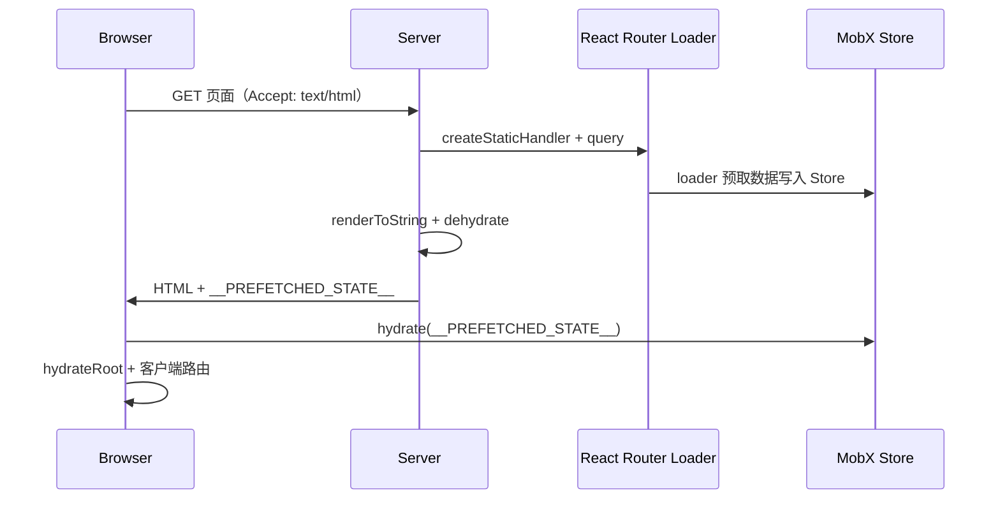

# vite-react-mobx-ssr

基于 **React 19 + MobX + Vite 8 + Express** 的 SSR 入门模板，集成 Ant Design 6、UnoCSS、React Router 7 数据路由，开箱即用开发/生产双模式服务端渲染。

## 特性

- **同构 SSR**：开发环境 Vite 中间件 SSR，生产环境 Express 静态资源 + 服务端渲染
- **数据预取**：React Router `loader` 在服务端拉取数据，经 MobX `dehydrate` / `hydrate` 注入客户端
- **状态管理**：MobX 6 + `mobx-react-lite`，模块化 Store，支持 SSR 状态序列化
- **UI 与样式**：Ant Design 6（`@ant-design/cssinjs`）+ UnoCSS 原子类 + SCSS
- **工程化**：TypeScript 严格模式、ESLint、Stylelint、路径别名 `@` / `~`
- **开发体验**：HMR、Mock 接口（`vite-plugin-mock`）、API 代理、自动导入（`unplugin-auto-import`）

## 技术栈

| 类别   | 技术                                                       |
| ------ | ---------------------------------------------------------- |
| 框架   | React 19、React Router 7（`createBrowserRouter` + Loader） |
| 状态   | MobX 6、`mobx-react-lite`                                  |
| 构建   | Vite 8、`@vitejs/plugin-react`、`@vitejs/plugin-legacy`    |
| 服务端 | Express 5、Node ESM                                        |
| UI     | Ant Design 6                                               |
| 样式   | UnoCSS、SCSS                                               |
| 请求   | Axios（客户端/服务端分离配置）                             |
| 语言   | TypeScript 6                                               |

## 目录结构

```text
├── src/
│   ├── api/              # API 封装（index-client / index-server 分环境）
│   ├── components/       # 公共组件（AppProvider、PageContainer 等）
│   ├── hooks/            # 自定义 Hooks
│   ├── layouts/          # 布局（MainLayout）
│   ├── pages/            # 页面（Home、Article）
│   ├── router/           # 路由表与 Loader（loaders.ts）
│   ├── stores/           # MobX Store（含 dehydrate / hydrate）
│   ├── styles/           # 全局样式与 Ant Design 主题
│   ├── types/            # 类型定义
│   ├── utils/            # 工具（request、createFetchRequest、env）
│   ├── index.client.tsx  # 客户端入口（hydrate）
│   ├── index.server.tsx  # 服务端同构渲染入口
│   └── server.ts         # 生产 Express 服务
├── mock/                 # 开发 Mock 数据
├── vite.config.ts        # 公共 Vite 配置
├── vite.config.dev.ts    # 开发（SSR 中间件 + Mock + 代理）
├── vite.config.prod.ts   # 客户端生产构建
├── vite.config.server.ts # 服务端同构 bundle
├── vite.config.node.ts   # Node 服务入口 bundle
├── creatAntdCss.ts       # 提取 Ant Design 静态 CSS
└── .env.example          # 环境变量示例
```

## 环境要求

- Node.js >= 18
- [pnpm](https://pnpm.io/)（推荐，见 `packageManager` 字段）

## 快速开始

```bash
npx degit lincenying/vite-react-mobx-ssr my-react-mobx-ssr-app
cd my-react-mobx-ssr-app
pnpm i   # 未安装 pnpm：npm install -g pnpm
cp .env.example .env
```

### 环境变量

复制 `.env.example` 为 `.env` 后按需修改：

| 变量                | 说明                                        |
| ------------------- | ------------------------------------------- |
| `VITE_SERVER_URL`   | SSR 服务端请求的后端域名                    |
| `VITE_API_BASE_URL` | 客户端 API 基础路径（开发环境走 Vite 代理） |

### 开发

```bash
pnpm serve
```

- 本地地址：<http://localhost:7778>
- 开发模式内置 SSR 中间件，仅对 HTML 页面导航做服务端渲染
- `/api` 代理至 `VITE_SERVER_URL`；`mock/` 目录可启用本地 Mock（见 `vite.config.dev.ts` 中 `localMock`）

### 生产构建与预览

```bash
pnpm build   # 依次：清理 → 客户端 → 服务端同构 → Node 服务 → Ant Design CSS
pnpm start   # 启动 dist/index.js
```

- 生产预览地址：<http://localhost:17778>

### 代码检查

```bash
pnpm lint        # ESLint 检测（不自动修复）
pnpm lint:fix    # ESLint 检测并修复
pnpm lint:ts     # TypeScript 类型检查
pnpm lint:css    # Stylelint 检测并修复
```

## SSR 流程简述



1. **服务端**：`index.server.tsx` 通过 `createStaticHandler` 执行路由 `loader`，将 MobX 状态 `dehydrate` 后嵌入 HTML。
2. **客户端**：`index.client.tsx` 读取 `window.__PREFETCHED_STATE__` 并 `hydrate`，再 `hydrateRoot` 接管交互。

> 页面组件中请避免在渲染阶段访问 `window` / `document` 等浏览器 API，应放入 `useEffect` 等客户端生命周期。

## 相关模板（Variations）

- [vite-nitro-vue3](https://github.com/lincenying/vite-nitro-vue3) - Vue3 + Nitro2 + ElementPlus + Vite web入门模板
- [vite-nitro-vue3-ssr](https://github.com/lincenying/vite-nitro-vue3-ssr) - Vue3 + Nitro2 + ElementPlus + Vite + SSR web入门模板
- [vite-nitro3-vue3](https://github.com/lincenying/vite-nitro3-vue3) - Vue3 + Nitro3 + ElementPlus + Vite + SSR web入门模板
- [vite-nuxt3](https://github.com/lincenying/vite-nuxt3) - Nuxt3 + Vite 入门模板
- [vite-vue3-admin](https://github.com/lincenying/vite-vue3-admin) - Vue3 + ElementPlus + Vite 管理后台入门模板
- [vite-vue3-h5](https://github.com/lincenying/vite-vue3-h5) - Vue3 + Vant + Vite 入门模板
- [vite-vue3-h5-ssr](https://github.com/lincenying/vite-vue3-h5-ssr) - Vue3 + Vant + Vite + SSR 入门模板
- [vite-vue3-uniapp](https://github.com/lincenying/vite-vue3-uniapp) - Uniapp3 + Vite 入门模板
- [vite-vue3-web](https://github.com/lincenying/vite-vue3-web) - Vue3 + ElementPlus + Vite web入门模板
- [vite-react-mobx](https://github.com/lincenying/vite-react-mobx) - React + Mobx + Vite 入门模板（CSR）
- **vite-react-mobx-ssr**（本仓库）- React + Mobx + Vite + SSR 入门模板
- [vite-react-redux](https://github.com/lincenying/vite-react-redux) - React + Redux + Vite 入门模板

## License

[MIT](./LICENSE)
